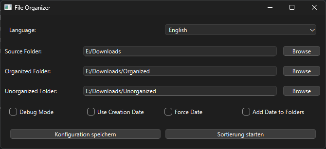

# Datei-Organisierer / File Organizer

Dieses Projekt ist eine Python-Anwendung mit grafischer Benutzeroberfläche, die Dateien automatisch basierend auf ihren Dateitypen sortiert. Die Anwendung unterstützt mehrere Sprachen und bietet umfangreiche Konfigurationsmöglichkeiten.

This is a Python application with a graphical user interface that automatically organizes files based on their types. The application supports multiple languages and offers extensive configuration options.

## Hauptfunktionen / Main Features

- 🌍 Mehrsprachig (Deutsch/Englisch) / Multilingual (German/English)
- 🖥️ Grafische Benutzeroberfläche / Graphical User Interface
- 📂 Automatische Dateisortierung / Automatic File Sorting
- 📅 Datums-basierte Organisierung / Date-based Organization
- 🔍 Debug-Modus mit Logging / Debug Mode with Logging
- ⚙️ Konfigurationsspeicherung / Configuration Saving

## Sprachen / Languages

Ausführliche Dokumentation ist verfügbar in: / Detailed documentation is available in:

- [Deutsch (German)](docs/README_de.md)
- [English](docs/README_en.md)

## Quick Start / Schnellstart

### Installation

1. Repository klonen / Clone repository:
```bash
git clone https://github.com/cherzlieb/py-file-organizer
cd py-file-organizer
```

2. Virtuelle Umgebung erstellen / Create virtual environment:
```bash
# Windows
python -m venv venv
.\venv\Scripts\activate

# Linux/Mac
python -m venv venv
source venv/bin/activate
```

3. Abhängigkeiten installieren / Install dependencies:
```bash
pip install -r requirements.txt
```

### Start / Launch

Starten Sie die Anwendung / Launch the application:
```bash
python src/main.py
```

### Erste Schritte / First Steps

1. Wählen Sie Ihre Sprache / Select your language
2. Konfigurieren Sie die Ordner / Configure folders:
   - Quellordner / Source folder
   - Zielordner / Target folder
   - Nicht-sortierbare / Unorganized
3. Klicken Sie auf "Start" / Click "Start"

### Screenshots

